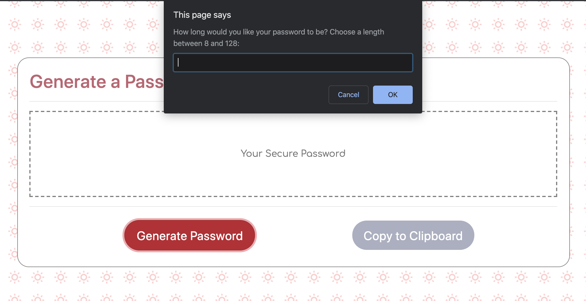

# PasswordGenerator
<h2>Description</h2>
This repository contains the files for a random password generator.  
A Bootstrap layout along with additional external styling was used to create the password generator form.
Javascript  for peforming the random secure password task.

<h2>Usage</h2>
On "Generate Secure Password" click, users will be prompted to choose the length of their random password; betweem 8 and 128 total characters.

After the user enters the length of the password, confirms will apear that include a choice of:
  <ul><li>Special Characters</li>
      <li>Numbers</li>
      <li>Uppercase Letters</li>
      <li>Lowercase Letters</li></ul>

