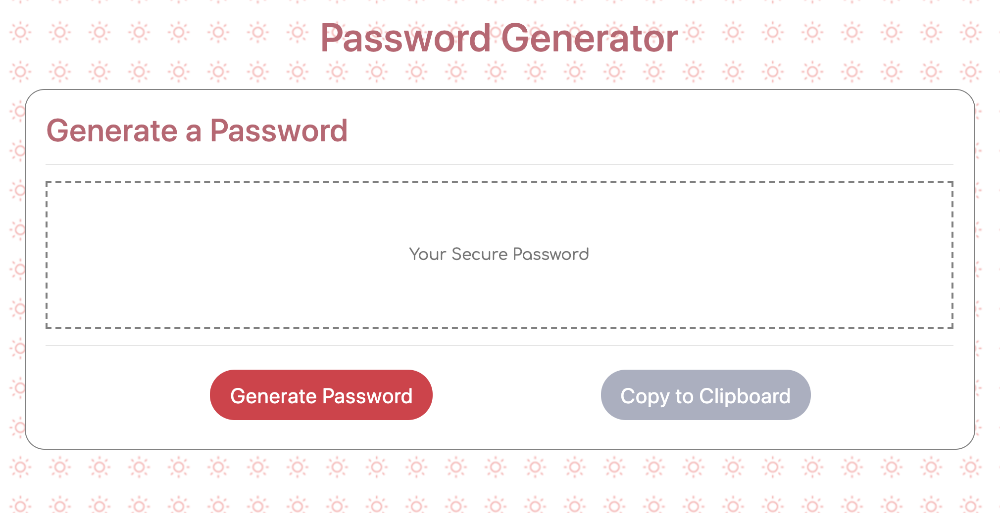

# PasswordGenerator
<h2>Description</h2>
This repository contains the files for a random password generator.  
A Bootstrap layout, along with additional external styling was used to style the password generator form.
Javascript was used for creating interactive buttons to perform the random secure password function.

<h2>Usage</h2>
When the "Generate Secure Password" button is clicked, users will be prompted to choose the length of their randomly generated password; betweem 8 and 128 total characters.

After the user submits the length of the password, confirmation boxes will apear that will ask for the specificm characterists the password will from  a choice of:
  <ul><li>Special Characters</li>
      <li>Numbers</li>
      <li>Uppercase Letters</li>
      <li>Lowercase Letters</li></ul>

The chosen combinations will decided which portion of the randomPass function will perform and print the generated password to the text box on screen.

